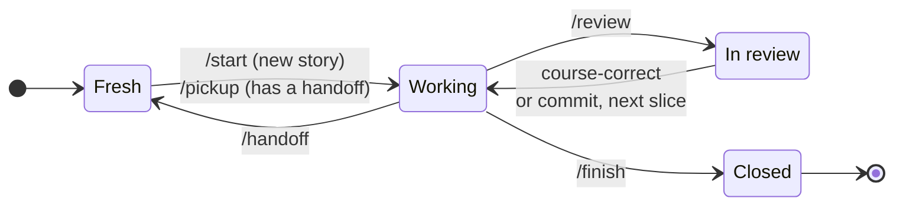

# Headquarters

Shared memory and workflow skills for agentic programming. Agents keep project knowledge, story-level working memory, and handoffs in `~/.headquarters`, outside every code repo, so any agent (Claude Code, Codex, ...) can pick up where another left off.

## Install

```bash
npx skills add nothingalike/headquarters --global
```

Install all the skills together: each one reads the shared guide at `../hq/GUIDE.md`.

Then run `/hq-setup` once on your machine, and `/hq-init` inside each project you work on.

## Skills

| Skill | Invoked by | What it does |
|---|---|---|
| `hq` | you or the agent | Recall, remember, update, or forget memory. Say "save this" and it decides where the information goes, filing documentation-style knowledge as tagged, cross-linked wiki notes in Google's [Open Knowledge Format](https://github.com/GoogleCloudPlatform/knowledge-catalog/blob/main/okf/SPEC.md) ([format](skills/hq/NOTES.md)). Holds [the guide](skills/hq/GUIDE.md) every other skill follows. |
| `hq-setup` | you, once per machine | Creates `~/.headquarters`, writes your working preferences (`me.md`), and points your agents at it. |
| `hq-init` | you, once per project | Interactive questionnaire that sets up or refreshes a project's `project.md`. |
| `handoff` | you | Writes a dated handoff for the current story so a fresh session can continue. |
| `pickup` | you | Reads a story's handoff trail and briefs you before resuming. |
| `review` | you or the agent | When a slice is done, opens an HTML report in your browser: sections about behaviour in review order, risk chips, every claim linked into VS Code, short snippets, the tests that prove each section, and a suggested commit message. |
| `plate` | you or the agent | Keeps what's on your plate across projects, plus a daily log of what got done, blockers, and questions. Agents log as they work; `/plate eod` and `/plate week` recap it. |
| `meetings` | you, each morning | Reads your calendar feeds (listed in `~/.headquarters/calendars/calendars.json`) and writes the day's meetings into the plate's daily log. Brings in each recorded meeting's summary and full transcript (from a recorder such as Wispr Flow) as a file in `~/.headquarters/meetings/`, puts your follow-ups on the plate, and takes quick notes with `/meetings note`. |
| `hq-artifact-design` | the agent | House method for HTML pages people read: tokens, type, light/dark, layout, copy, and local-page mechanics. Our own version of the artifact-design method, used by `review` and any report an agent writes. |

## Workflow

Working on a user story moves through four states. Each transition is a skill, or an action you take yourself.



| State | What's happening |
|---|---|
| **Fresh** | A new session with no context loaded. |
| **Working** | The agent is oriented on the story and building. |
| **In review** | The agent has reported what it did and why, and waits for you. |
| **Closed** | The agent's work on the story is done; lessons are promoted and the final record is written. |

| Transition | Skill | What it does |
|---|---|---|
| Fresh → Working | `/start` *(planned)* | Begins a new story: sets up its headquarters folder and analyzes the story. |
| Fresh → Working | `/pickup` | Resumes from the story's handoff trail and briefs you first. |
| Working → Fresh | `/handoff` | Captures the session so a fresh one can continue with a clear head. |
| Working → In review | `/review` | Reports what was done and why, linking files and lines. |
| In review → Working | you | Course-correct, or commit and move on to the next slice. |
| Working → Closed | `/finish` *(planned)* | Promotes lessons, writes the story's final record, and produces an outcome report for the team: evidence of what changed, alongside the code review. |

Nothing stores the current state: it's worked out from what's in the story's headquarters folder and from the conversation. These states are separate from your tracker's story statuses, which change only when you ask.

## Notes wiki

Not everything you learn belongs to a story. Tell `hq` to save it, in plain words or with `/hq`, and it picks the home:

| What you're saving | Where it goes |
|---|---|
| How you like to work, across every project | `me.md` |
| Working memory for one story | `<project>/stories/<ID>/notes.md` |
| A one- or two-line fact every session should see | the project's `project.md` |
| Documentation: how something works, how to do something, terms, decisions, what someone explained | a note in the project's `notes/`, or in `~/.headquarters/notes/` when it spans projects or belongs to none |

Each note is one Markdown page per topic in Google's [Open Knowledge Format](https://github.com/GoogleCloudPlatform/knowledge-catalog/blob/main/okf/SPEC.md). Its frontmatter carries a `type` (how-to, reference, explainer, decision, troubleshooting, glossary), a one-line `description`, `tags` drawn from a shared `~/.headquarters/tags.md`, `aliases`, a `status` (draft, stable, deprecated), and `sources` linking back to the meeting or story it came from. Notes link to each other with relative Markdown links. Every `notes/` folder keeps an `index.md` listing its notes and a `log.md` of changes. [NOTES.md](skills/hq/NOTES.md) has the full format.

Before creating a note, the agent looks for one on the same topic and extends it instead. Agents also file notes on their own when they learn something worth keeping, and tell you where they put it.

### Examples

```text
save this: Bob says billing-api deploys go through the staging slot; swap after the worker shows the new release
  → billing-api/notes/deploying-to-staging.md (how-to), listed in billing-api/notes/index.md

note that Shopify app proxies strip cookies, so auth goes through the signed query params
  → notes/shopify-app-proxy.md: true for any Shopify store, so it goes outside the project

remember we picked a queue worker over serverless functions because the payment provider calls need retries with backoff
  → a decision note

save this: build the theme with `npm ci --engine-strict=false`
  → one line under "Things to know" in project.md

what do we know about deploying billing-api?
  → searches indexes, tags, aliases, stories, handoffs, and meetings; answers with the file behind each fact

the staging deploy note is wrong, we use blue-green now
  → updates the note, logs the change, and reports the old and new claim

forget the Node 18 workaround note, we upgraded
  → marks it deprecated with what replaced it ("delete it" removes it outright)
```

Say where the knowledge came from ("Bob said", "from today's standup") so the note links back to it. Open `~/.headquarters` as an Obsidian vault to browse notes by tag and link.
