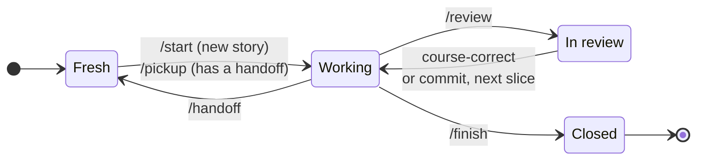

# Headquarters

Shared memory and workflow skills for agentic programming. Agents keep project knowledge, story-level working memory, and handoffs in `~/.headquarters`, outside every code repo, so any agent (Claude Code, Codex, ...) can pick up where another left off.

## Install

```bash
npx skills add nothingalike/headquarters --global
```

Install all the skills together: each one reads the shared guide at `../hq/GUIDE.md`.

Then run `/hq-setup` once on your machine, and `/hq-init` inside each project you work on.

## Skills

| Skill | Invoked by | What it does |
|---|---|---|
| `hq` | you or the agent | Recall, remember, update, or forget memory. Holds [the guide](skills/hq/GUIDE.md) every other skill follows. |
| `hq-setup` | you, once per machine | Creates `~/.headquarters`, writes your working preferences (`me.md`), and points your agents at it. |
| `hq-init` | you, once per project | Interactive questionnaire that sets up or refreshes a project's `project.md`. |
| `handoff` | you | Writes a dated handoff for the current story so a fresh session can continue. |
| `pickup` | you | Reads a story's handoff trail and briefs you before resuming. |
| `review` | you or the agent | When a slice is done, opens an HTML report in your browser: sections about behaviour in review order, risk chips, every claim linked into VS Code, short snippets, the tests that prove each section, and a suggested commit message. |
| `plate` | you or the agent | Keeps what's on your plate across projects, plus a daily log of what got done, blockers, and questions. Agents log as they work; `/plate eod` and `/plate week` recap it. |
| `meetings` | you, each morning | Reads your calendar feeds (listed in `~/.headquarters/calendars/calendars.json`) and writes the day's meetings into the plate's daily log. Brings in each recorded meeting's summary and full transcript (from a recorder such as Wispr Flow) as a file in `~/.headquarters/meetings/`, puts your follow-ups on the plate, and takes quick notes with `/meetings note`. |
| `hq-artifact-design` | the agent | House method for HTML pages people read: tokens, type, light/dark, layout, copy, and local-page mechanics. Our own version of the artifact-design method, used by `review` and any report an agent writes. |

## Workflow

Working on a user story moves through four states. Each transition is a skill, or an action you take yourself.



| State | What's happening |
|---|---|
| **Fresh** | A new session with no context loaded. |
| **Working** | The agent is oriented on the story and building. |
| **In review** | The agent has reported what it did and why, and waits for you. |
| **Closed** | The agent's work on the story is done; lessons are promoted and the final record is written. |

| Transition | Skill | What it does |
|---|---|---|
| Fresh → Working | `/start` *(planned)* | Begins a new story: sets up its headquarters folder and analyzes the story. |
| Fresh → Working | `/pickup` | Resumes from the story's handoff trail and briefs you first. |
| Working → Fresh | `/handoff` | Captures the session so a fresh one can continue with a clear head. |
| Working → In review | `/review` | Reports what was done and why, linking files and lines. |
| In review → Working | you | Course-correct, or commit and move on to the next slice. |
| Working → Closed | `/finish` *(planned)* | Promotes lessons, writes the story's final record, and produces an outcome report for the team: evidence of what changed, alongside the code review. |

Nothing stores the current state: it's worked out from what's in the story's headquarters folder and from the conversation. These states are separate from your tracker's story statuses, which change only when you ask.
